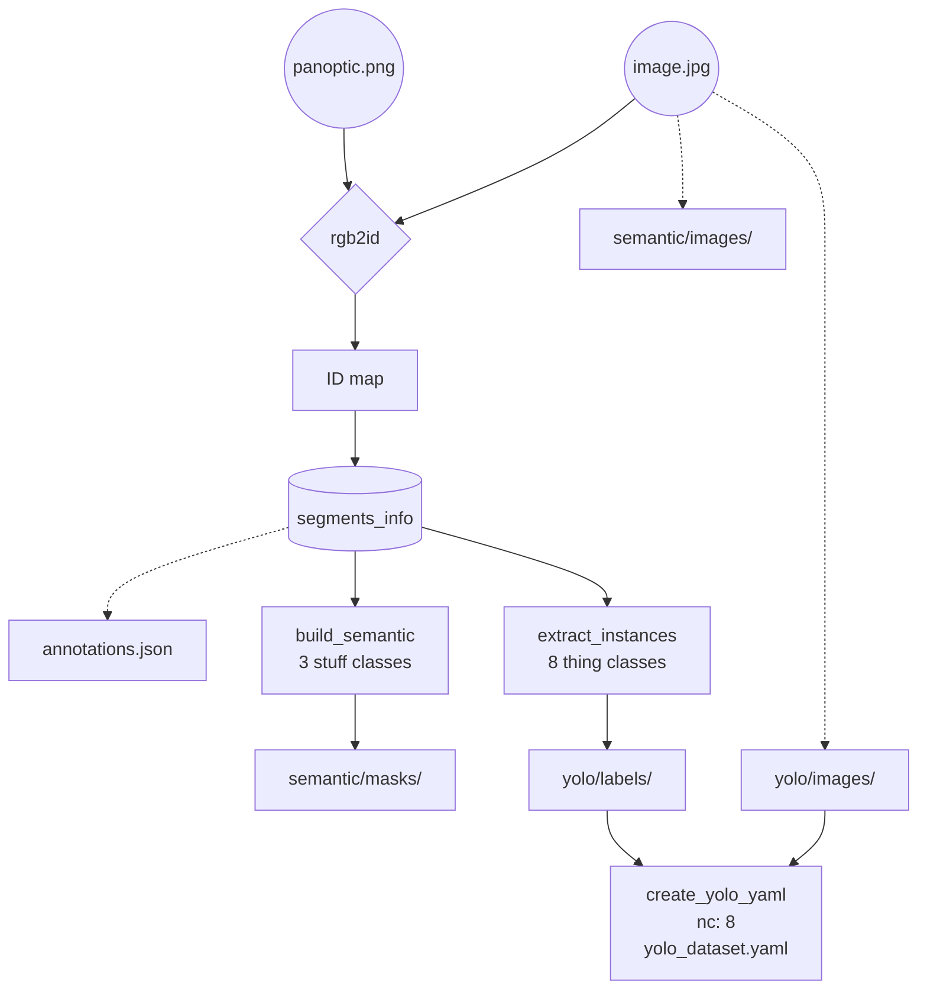
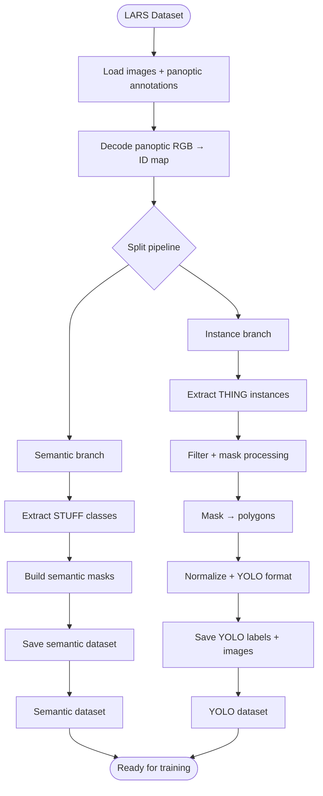

# LaRS Dataset Pipeline 🚀

## Пайплайн обработки изображения

### Вариант 1

```mermaid
flowchart TD
    A((image.jpg)) --> B{rgb2id}
    C((panoptic.png)) --> B
    B --> D[ID map]
    D --> E[(segments_info)]
    E -.-> F[annotations.json]
    
    E --> F1[build_semantic<br/>3 stuff classes]
    E --> F2[extract_instances<br/>8 thing classes]
    
    F1 --> G1[semantic/masks/]
    F2 --> G2[yolo/labels/]
    
    A -.-> G3[semantic/images/]
    A -.-> G4[yolo/images/]
    
    G2 --> H[create_yolo_yaml<br/>nc: 8<br/>yolo_dataset.yaml]
    G4 --> H
```

### Вариант 2

```mermaid
flowchart TD


    A([LARS Dataset]) --> B[Load images + panoptic annotations]
    B --> C[Decode panoptic RGB → ID map]


    C --> D{Split pipeline}


    D --> S1[Semantic branch]
    D --> I1[Instance branch]


    %% Semantic
    S1 --> S2[Extract STUFF classes]
    S2 --> S3[Build semantic masks]
    S3 --> S4[Save semantic dataset]


    %% Instance
    I1 --> I2[Extract THING instances]
    I2 --> I3[Filter + mask processing]
    I3 --> I4[Mask → polygons]
    I4 --> I5[Normalize + YOLO format]
    I5 --> I6[Save YOLO labels + images]


    %% Output
    S4 --> O1[Semantic dataset]
    I6 --> O2[YOLO dataset]


    O1 --> F([Ready for training])
    O2 --> F
```
