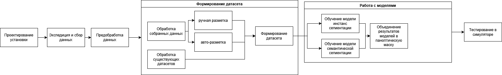
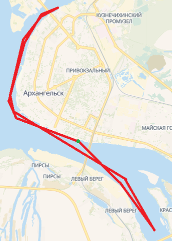
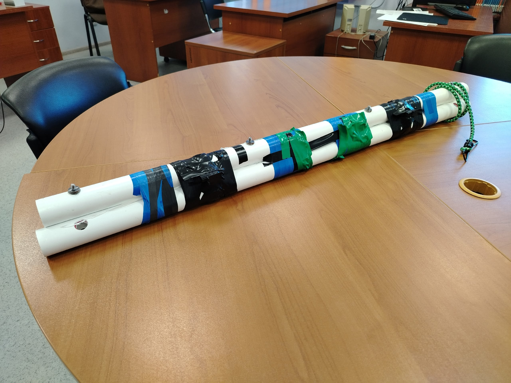
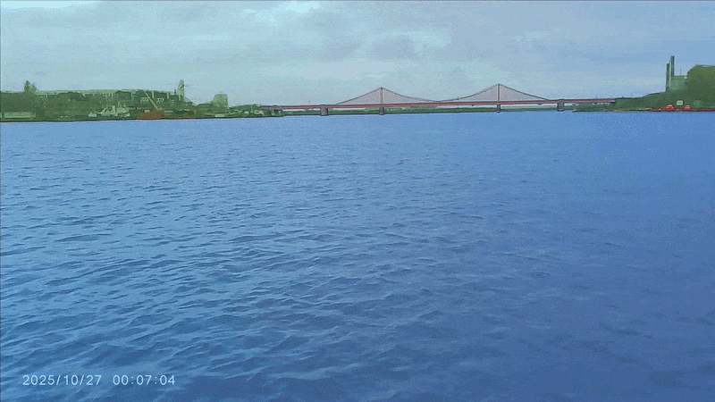
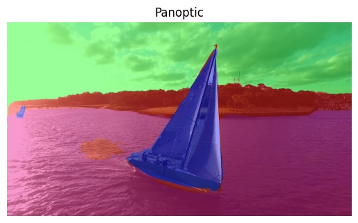
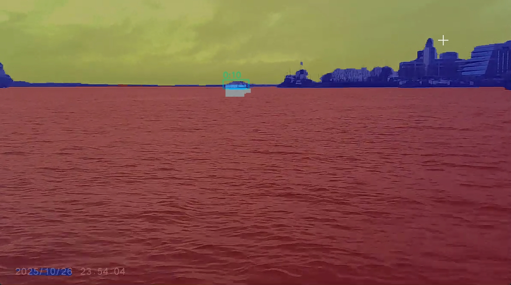
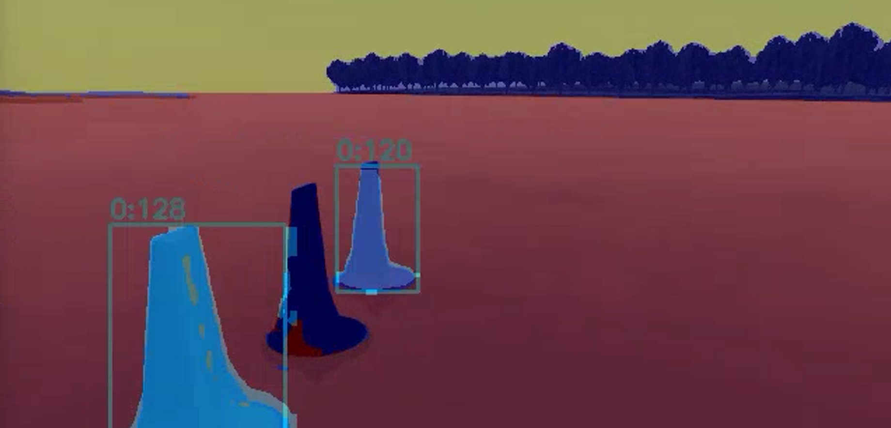
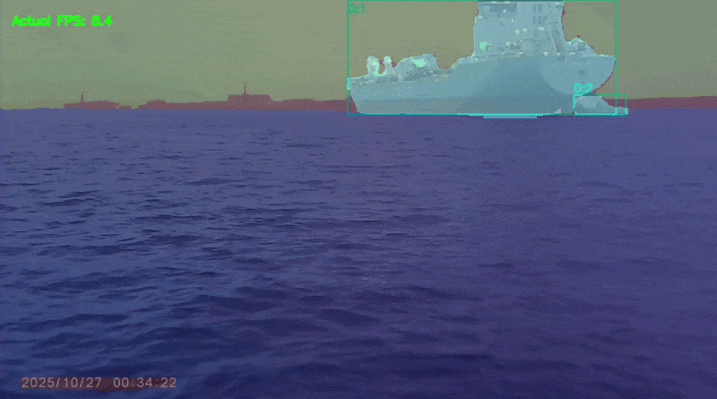
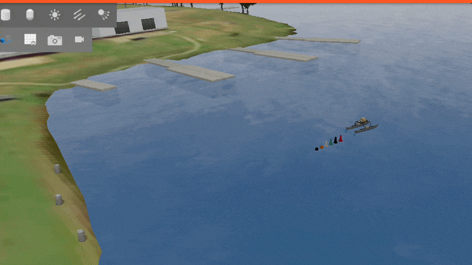
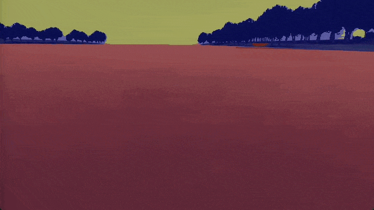

# USV Obstacle Detection and Localization System


[](https://www.python.org/)
[](https://docs.astral.sh/uv/)


Программный комплекс для подготовки данных, сегментации водной сцены и
обнаружения надводных препятствий для безэкипажного надводного судна
(*Unmanned Surface Vehicle*, USV).

Проект выполнен в рамках выпускной квалификационной работы. Его цель — создать
воспроизводимый pipeline для сбора и подготовки видеоданных, разметки,
обучения моделей компьютерного зрения, паноптического восприятия сцены и
тестирования алгоритмов в симуляторе.

> **Статус проекта:** реализованы инструменты подготовки данных и
> автоматической разметки, обучение и оценка моделей сегментации, panoptic
> fusion и демонстрационные сценарии в Gazebo. Интеграция пространственной
> локализации препятствий по стереоданным и данным IMU/GPS является следующим
> этапом развития системы.

---

## System pipeline



Работа над проектом охватывает весь цикл: проектирование измерительной
установки, сбор натурных данных, предобработку и формирование датасета,
обучение моделей, объединение результатов в паноптическое представление и
тестирование в симуляторе.

1. **Проектирование и сбор данных** — установка камер и сенсоров на катер,
   проведение натурной съёмки.
2. **Подготовка датасета** — обработка исходных видеозаписей, извлечение и
   отбор клипов, подготовка кадров к разметке.
3. **Разметка** — ручная разметка в CVAT и автоматическое создание черновых
   аннотаций.
4. **Обучение моделей** — отдельное обучение instance- и semantic-моделей.
5. **Panoptic fusion** — объединение экземплярных масок объектов с
   семантической картой фона.
6. **Тестирование** — проверка моделей на LaRS, собственном видеоряде и в
   Gazebo VRX.

---

## Datasets

Для обучения и оценки моделей использовались два источника данных:

- **LaRS** — публичный датасет изображений водных сцен с аннотациями для
  задач сегментации.
- **Собственный датасет** — видеоряд, собранный с измерительной установки,
  размещённой на катере в акватории Архангельска.

Модели обучались на данных LaRS и части размеченного собственного датасета.
Часть собственных данных была отложена и использовалась для оценки качества
моделей на ранее не виденных натурных кадрах.

Для увеличения объёма и разнообразия обучающей выборки к данным LaRS и
собственному датасету применялись аугментации. Разделение на обучающую,
валидационную и тестовую подвыборки выполнялось до аугментации, поэтому
аугментированные варианты тестовых кадров не использовались при обучении.

Для реализации паноптического восприятия аннотации LaRS были разделены на два
представления:

- **Instance subset** — отдельные экземпляры объектов (*things*).
- **Semantic subset** — семантические области фона (*stuff*).

Такое разделение позволяет независимо обучать instance- и semantic-модели, а
затем объединять их предсказания на этапе panoptic fusion.

---

## Data collection

Для сбора натурных данных измерительная установка была размещена на носу
катера. Видеосъёмка выполнялась во время движения по маршруту в акватории
Архангельска, что позволило получить кадры водной поверхности, береговой линии,
судов и других объектов в целевых условиях эксплуатации USV.





Исходные видеозаписи проходили обработку: из них извлекались кадры, клипы
отбирались для разметки и обучения, а данные приводились к структуре,
используемой остальными модулями проекта.


Подробное описание подготовки исходных видео, извлечения кадров и формирования
клипов приведено в документации модуля:
[`src/usv/data_loader/README.md`](src/usv/data_loader/README.md).

---

## Automatic annotation

Модуль автоматической разметки формирует черновые маски и траектории объектов
для последующей проверки и корректировки в CVAT.


Полученные аннотации проверяются и при необходимости корректируются вручную
перед использованием в качестве ground truth.



Поддерживаются три режима:

| Режим CLI | Содержимое | Формат результата |
|---|---|---|
| `instance` | Маски отдельных объектов (*things*) | COCO JSON |
| `semantic` | Семантические карты классов (*stuff*) | PNG label maps |
| `panoptic` | Объекты и семантический фон после fusion | CVAT Video XML |

Для быстрого режима применяется сегментационная модель YOLOv8 и IoU-трекинг.
Режим `cpu-sam2` использует Florence-2 для детекции, SAM 2 для трекинга и при
необходимости SegFormer для семантической сегментации фона.

Подробная техническая документация:
[`src/usv/auto_annotation/README.md`](src/usv/auto_annotation/README.md).

---

## Panoptic perception

Паноптическое восприятие реализовано не одной end-to-end моделью, а слиянием
результатов двух специализированных моделей.

```text
Instance segmentation ──> маски отдельных объектов (things) ─┐
                                                            ├─> Panoptic fusion
Semantic segmentation ──> классы фона и областей (stuff) ────┘
                                                                  │
                                                                  ▼
                                                       Паноптическая карта сцены
```

| Задача | Результат | Примеры классов | Назначение |
|---|---|---|---|
| Instance segmentation | Отдельная маска для каждого объекта | Судно, буй, человек, препятствие | Обнаружение и разделение объектов |
| Semantic segmentation | Метка класса для каждого пикселя | Вода, небо, берег, растительность | Понимание структуры водной сцены |
| Panoptic fusion | Единая непересекающаяся карта | Things + stuff | Полное представление сцены |

Panoptic fusion разрешает пересечения между instance-масками и semantic-картой,
после чего формируется единое представление кадра без конфликтующих областей.

---

## Model results

В проекте исследуются модели семантической и экземплярной сегментации.
Итоговое паноптическое представление строится на этапе fusion, который
объединяет предсказания двух специализированных моделей.

| Направление | Модель / подход | Результат |
|---|---|---|
| Semantic segmentation | DeepLabV3 с ResNet-50 | mIoU: **0.962**, Pixel Accuracy: **0.981** |
| Instance segmentation | YOLO26m | box mAP@50: **0.493**, mask mAP@50: **0.357** |
| Instance segmentation | YOLACT | Исследовалась как альтернативная модель экземплярной сегментации |
| Panoptic perception | Panoptic fusion | Объединение instance- и semantic-предсказаний |

Метрики относятся к разным задачам и не должны напрямую сравниваться между
собой: mIoU и Pixel Accuracy оценивают семантическую сегментацию, а box/mask
mAP@50 — качество детекции и экземплярных масок.

| model result lars                                                                                    | model result own dataset                                                                                    | model result simulator                                                                                 |
| ---------------------------------------------------------------------------------------------------- | ----------------------------------------------------------------------------------------------------------- | ------------------------------------------------------------------------------------------------------ |
|  |  |  |

Ниже показана работа моделей на клипе, снятом измерительной установкой и
включённом в собственный датасет.



---

## Simulation

Gazebo VRX и ROS 2 используются для воспроизводимой проверки сценариев работы
USV в контролируемой среде. Симулятор позволяет изменять конфигурацию сцены,
взаимное расположение объектов и траекторию судна без проведения натурных
испытаний.

### USV motion

Вид сверху показывает движение катера и прохождение сценария в симуляторе.



### Perception from onboard camera

Вид с бортовой камеры показывает работу моделей сегментации на видеоряде,
получаемом в Gazebo.



Симуляционные эксперименты дополняют проверку на LaRS и собственных данных, но
не заменяют испытания на реальной воде.

---

## Repository structure

```text
USV-Obstacle-Detection/
├── assets/                         # Демонстрационные изображения и GIF
├── configs/                        # YAML-конфигурации
├── data/                           # Данные, не отслеживаются Git
├── models/                         # Веса моделей, не отслеживаются Git
├── notebooks/                      # Jupyter notebooks для экспериментов
├── scripts/
│   ├── download_checkpoints.py     # Загрузка checkpoint SAM 2.1
│   ├── export_cvat.py              # Экспорт аннотаций
│   ├── run_auto_annotation.py      # Запуск автоматической разметки
│   ├── validate_annotations.py     # Валидация аннотаций
│   └── visualize_annotations.py    # Визуализация аннотаций
├── src/usv/
│   ├── auto_annotation/            # Pipeline автоматической разметки
│   └── data_loader/                # Подготовка видеоданных и клипов
├── tests/                          # Автоматические тесты
├── pyproject.toml                  # Зависимости и настройки проекта
└── README.md
```

---

## Installation

Проект использует [uv](https://docs.astral.sh/uv/) для управления окружением и
зависимостями.

### Clone repository

```bash
git clone https://github.com/<username>/USV-Obstacle-Detection.git
cd USV-Obstacle-Detection
```

### Install uv

Windows PowerShell:

```powershell
powershell -ExecutionPolicy ByPass -c "irm https://astral.sh/uv/install.ps1 | iex"
```

macOS / Linux:

```bash
curl -LsSf https://astral.sh/uv/install.sh | sh
```

### Create environment

```bash
uv sync
```

Команда создаст виртуальное окружение `.venv` и установит зависимости,
зафиксированные в `uv.lock`.

---

## Quick start

### Download SAM 2 checkpoint

Для режима `cpu-sam2` загрузите checkpoint:

```bash
uv run python -m scripts.download_checkpoints
```

По умолчанию checkpoint будет сохранён в:

```text
models/sam2.1_hiera_small.pt
```

### Run automatic annotation

Обработка одного клипа в паноптическом режиме:

```bash
uv run python -m scripts.run_auto_annotation \
  --mode cpu-sam2 \
  --annot-mode panoptic \
  --clip-name <clip_name> \
  --output-dir data/interim/auto_annotations
```

Быстрый CPU-режим с YOLOv8 segmentation:

```bash
uv run python -m scripts.run_auto_annotation \
  --mode cpu-fast \
  --annot-mode panoptic \
  --clip-name <clip_name> \
  --output-dir data/interim/auto_annotations
```

### Visualize annotations

```bash
uv run python -m scripts.visualize_annotations \
  --annot-mode panoptic \
  --clip-name <clip_name> \
  --annotation-dir data/interim/auto_annotations \
  --output-video data/interim/auto_annotations/preview.mp4 \
  --fps 5 \
  --opacity 0.4
```

Полный список параметров:

```bash
uv run python -m scripts.run_auto_annotation --help
uv run python -m scripts.visualize_annotations --help
uv run python -m scripts.download_checkpoints --help
```

---

## Testing

Запуск полного набора тестов:

```bash
uv run pytest tests/ -q
```

Текущее состояние:

```text
88 passed, 4 skipped
```

---

## Data and model artifacts

В Git не включаются:

- исходные видеозаписи и извлечённые кадры;
- полные наборы данных;
- checkpoint-файлы моделей;
- промежуточные результаты экспериментов;
- экспортированные видео и визуализации.

Пример ожидаемой структуры данных для запуска auto-annotation:

```text
data/
└── interim/
    └── choosed_clips_v5-1/
        ├── frames/
        │   └── <clip_name>/
        │       ├── 000000.jpeg
        │       ├── 000001.jpeg
        │       └── ...
        └── metadata/
```

---

## Documentation

- [Выпускная квалификационная работа (PDF)](https://drive.google.com/file/d/1VSdn06FgHifeJoClTo5VKPftuXmGqUSo/view?usp=sharing)
- [Презентация проекта (PPTX/PDF)](https://docs.google.com/presentation/d/1dAXsffb9dgLkYxG2OchAl99gC4kRe9g1/edit?usp=sharing&ouid=107110687382688068742&rtpof=true&sd=true)
- [Документация модуля подготовки данных](src/usv/data_loader/README.md)
- [Документация модуля автоматической разметки](src/usv/auto_annotation/README.md)

---

## Authors

### Жарый Дмитрий Александрович

- Сбор натурных данных и их обработка
- Ручная разметка данных в CVAT
- Разработка и настройка автоматической разметки
- Настройка симуляционной среды Gazebo

### Загидуллин Евгений Александрович

- Анализ существующих датасетов для задач сегментации водных сцен
- Обработка датасета LaRS и подготовка его instance- и semantic-частей
- Обучение и оценка моделей сегментации
- Объединение результатов instance- и semantic-моделей в паноптическое представление сцены (*panoptic fusion*)
