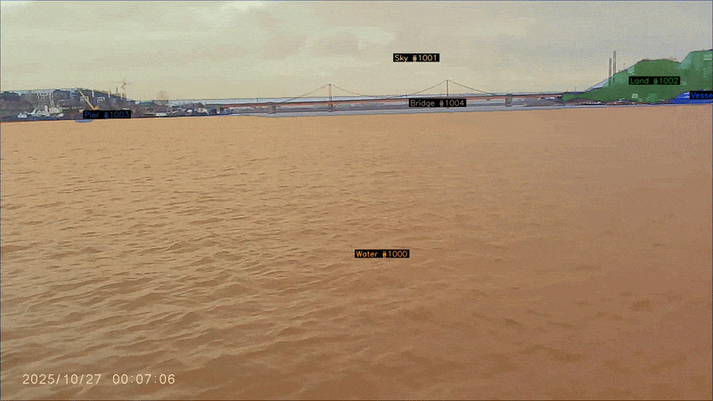

# Automatic Video Annotation for USV Obstacle Detection

This module generates preliminary video annotations for the USV obstacle
detection dataset. It is designed to accelerate dataset preparation: the
pipeline creates draft masks and object tracks, while the final annotation is
reviewed and corrected manually in CVAT.

The module supports a lightweight YOLOv8 baseline and a multi-keyframe
Florence-2 + SAM2 pipeline for longer clips.

## Examples

### Automatic pre-annotation

The pipeline detects objects, produces masks, creates temporal tracks, and
exports draft annotations.



### Manual annotation review

Generated annotations are imported into CVAT and corrected by an annotator
before they are used as ground-truth data.


## Pipeline modes

| Mode | Detection and segmentation | Tracking | Main use case |
|---|---|---|---|
| `cpu-fast` | YOLOv8 segmentation | IoU tracker | Fast baseline without SAM2 |
| `cpu-sam2` | Florence-2 detection, SAM2 masks and tracking | SAM2 video propagation | Higher-quality pre-annotation and multi-keyframe tracking |

## Annotation modes

| Annotation mode | Content | Output format |
|---|---|---|
| `panoptic` | Object tracks and semantic stuff tracks | CVAT XML |
| `instance` | Thing-object instance masks and tracks | COCO JSON |
| `semantic` | Water, Sky, Land, Pier, Bridge | PNG label maps |

The semantic mode produces label maps for the following stuff classes:

- Water
- Sky
- Land
- Pier
- Bridge

## Requirements

The project uses [uv](https://docs.astral.sh/uv/) for dependency management.

```powershell
uv sync
```

All commands below use `uv run`, so activating `.venv` is optional.

```powershell
uv run python -m scripts.run_auto_annotation --help
```

## Model checkpoints

Model weights are not stored in Git. Keep them in the local `models/`
directory.

### SAM 2.1

The `cpu-sam2` mode requires the SAM 2.1 Hiera Small checkpoint.

```powershell
uv run python -m scripts.download_checkpoints
```

Default output:

```text
models/sam2.1_hiera_small.pt
```

To specify another destination:

```powershell
uv run python -m scripts.download_checkpoints `
    --output models/sam2.1_hiera_small.pt
```

### YOLOv8

The `cpu-fast` mode requires a YOLOv8 segmentation checkpoint, for example:

```text
models/yolov8n-seg.pt
```

The standard `yolov8n-seg` model is not fine-tuned on the maritime dataset.
It can detect some vessels, but detections may be unstable and incomplete.
Therefore, its results must be treated as draft pre-annotations.

## Input layout

### Selected clips

The selected video clips prepared for annotation are available in Google Drive:

[Download selected clips for annotation](https://drive.google.com/drive/folders/1PZwSLR4qRzrMdJqezerzbGgIOx7rM4WL?usp=sharing)

Download the clips and extract or arrange their frames according to the input
layout below. Dataset files are not stored in this repository.

By default, the pipeline reads clips from:

```text
data/interim/choosed_clips_v5-1/
├── frames/
│   └── <clip_name>/
│       ├── 00000.jpeg
│       ├── 00001.jpeg
│       └── ...
└── metadata/
```

Each clip is represented by a directory of numbered image frames.

A separate directory containing clip subdirectories can also be processed with
`--input-dir`. This mode does not require metadata CSV files.

## Running annotation

### CPU-fast baseline

This mode runs YOLOv8 segmentation on frames and connects detections with an
IoU tracker. It exports CVAT XML tracks.

```powershell
uv run python -m scripts.run_auto_annotation `
    --mode cpu-fast `
    --model-path .\models\yolov8n-seg.pt `
    --clip-name right_MOVI0017_0001 `
    --output-dir data/interim/auto_annotations `
    --no-skip-existing
```

To process every clip under the default input directory:

```powershell
uv run python -m scripts.run_auto_annotation `
    --mode cpu-fast `
    --model-path .\models\yolov8n-seg.pt `
    --all `
    --output-dir data/interim/auto_annotations `
    --skip-existing
```

### CPU-SAM2 panoptic output

This mode uses Florence-2 detection and SAM2 video tracking. Panoptic mode
exports CVAT XML tracks.

```powershell
uv run python -m scripts.run_auto_annotation `
    --mode cpu-sam2 `
    --annot-mode panoptic `
    --clip-name right_MOVI0017_0001 `
    --output-dir data/interim/auto_annotations `
    --no-skip-existing
```

### CPU-SAM2 instance output

Instance mode exports thing-object annotations as a COCO JSON file.

```powershell
uv run python -m scripts.run_auto_annotation `
    --mode cpu-sam2 `
    --annot-mode instance `
    --clip-name right_MOVI0017_0001 `
    --output-dir data/interim/auto_annotations `
    --no-skip-existing
```

### CPU-SAM2 semantic output

Semantic mode creates PNG label maps for Water, Sky, Land, Pier, and Bridge.

```powershell
uv run python -m scripts.run_auto_annotation `
    --mode cpu-sam2 `
    --annot-mode semantic `
    --clip-name right_MOVI0017_0001 `
    --output-dir data/interim/auto_annotations `
    --no-skip-existing
```

### Processing an external frame directory

Use `--input-dir` when clips are stored outside the default dataset layout.

```powershell
uv run python -m scripts.run_auto_annotation `
    --mode cpu-sam2 `
    --annot-mode semantic `
    --input-dir data/interim/choosed_clips_v5-1/frames `
    --output-dir data/interim/auto_annotations `
    --skip-existing
```

## Output layout

For an output directory such as `data/interim/auto_annotations`, artifacts are
created in the following layout:

```text
data/interim/auto_annotations/
├── cvat_export/
│   ├── <clip_name>/
│   │   └── annotations.xml
│   └── <clip_name>_coco.json
├── label_maps/
│   └── <clip_name>/
│       ├── 00000.png
│       ├── 00001.png
│       └── ...
├── debug/
└── debug_frames/
```

- `panoptic` output: CVAT XML tracks in `cvat_export/<clip_name>/`
- `instance` output: COCO JSON in `cvat_export/`
- `semantic` output: PNG label maps in `label_maps/<clip_name>/`
- `debug` and `debug_frames`: optional intermediate and visualization files

## Visualizing results

### Panoptic CVAT XML

```powershell
uv run python -m scripts.visualize_annotations `
    --annot-mode panoptic `
    --clip-name right_MOVI0017_0001 `
    --annotation-dir data/interim/auto_annotations `
    --clips-dir data/interim/choosed_clips_v5-1 `
    --output-video .\data\interim\auto_annotations\panoptic_preview.mp4 `
    --fps 5 `
    --opacity 0.4
```

### Instance COCO JSON

```powershell
uv run python -m scripts.visualize_annotations `
    --annot-mode instance `
    --clip-name right_MOVI0017_0001 `
    --annotation-dir data/interim/auto_annotations `
    --clips-dir data/interim/choosed_clips_v5-1 `
    --output-video .\data\interim\auto_annotations\instance_preview.mp4 `
    --fps 5 `
    --opacity 0.4
```

### Semantic label maps

```powershell
uv run python -m scripts.visualize_annotations `
    --annot-mode semantic `
    --clip-name right_MOVI0017_0001 `
    --annotation-dir data/interim/auto_annotations `
    --clips-dir data/interim/choosed_clips_v5-1 `
    --output-video .\data\interim\auto_annotations\semantic_preview.mp4 `
    --fps 5 `
    --opacity 0.4
```

To save rendered JPEG frames instead of MP4, use `--output-frames`:

```powershell
uv run python -m scripts.visualize_annotations `
    --annot-mode semantic `
    --clip-name right_MOVI0017_0001 `
    --annotation-dir data/interim/auto_annotations `
    --clips-dir data/interim/choosed_clips_v5-1 `
    --output-frames .\data\interim\auto_annotations\semantic_preview_frames `
    --opacity 0.4
```

## Multi-keyframe tracking

For longer clips, the `cpu-sam2` pipeline can split tracking into segments.
At each segment boundary, object detection and SAM2 initialization are repeated.
Tracks from neighbouring segments are matched and stitched to preserve object
identity across the full clip.

The segment length is configured in:

```text
configs/auto_annotation.yaml
```

Example configuration:

```yaml
multi_keyframe_interval: 8
```

For an interval of `8`, a 25-frame clip is processed in segments beginning at
frames 0, 8, 16 and 24.

The implementation preserves:

- Absolute keyframe indices across the full clip
- One track ID for matching objects across segment boundaries
- No duplicated keyframe indices after track stitching

## Known limitations

- The standard `yolov8n-seg` checkpoint is not fine-tuned on project-specific
  maritime data, so vessel detection quality can be unstable.
- SAM2 propagated masks can have a small temporal shift for some clips.
- Multi-keyframe execution, visualization, and track stitching were verified,
  including preservation of track IDs at segment boundaries.
- Generated outputs are pre-annotations, not final ground truth.

All exported annotations must be visually reviewed and corrected in CVAT before
they are used for training or evaluation.

## Testing

Run the complete automated test suite:

```powershell
uv run pytest tests/ -q
```

The tests cover clip loading, mask utilities, IoU tracking, multi-keyframe
tracking, exporters, annotation visualization, and checkpoint download logic.

Some YOLOv8 detector tests may be skipped if their optional local checkpoint is
not available.

## Importing into CVAT

1. Create a CVAT task using the corresponding video frames.
2. Open the task menu and choose **Upload annotations**.
3. Select the generated `annotations.xml` from:

   ```text
   data/interim/auto_annotations/cvat_export/<clip_name>/annotations.xml
   ```

4. Choose the **CVAT 1.1** format.
5. Inspect masks, track continuity, and labels before saving corrected
   annotations as ground truth.