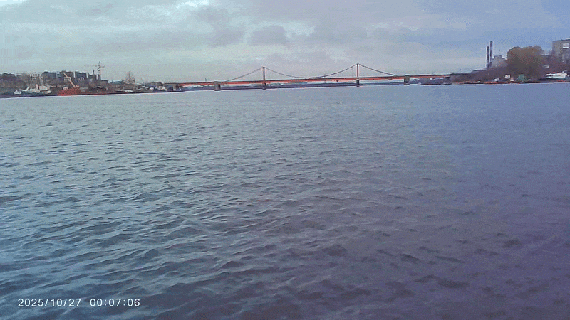

# USV Obstacle Detection: Dataset Preparation

This branch contains the data-preparation part of a graduation project on detecting surface obstacles for an Unmanned Surface Vehicle (USV).

The pipeline converts locally collected raw videos from onboard cameras into sampled frames and short video clips with frame-level metadata. These artifacts are intended for subsequent manual annotation, auto-annotation, and model training stages maintained separately.

## Scope

The target scenario is the preparation of visual data recorded from left, right, and center cameras installed on a USV.

This branch covers:

- Extracting sampled frames from raw videos
- Applying an ignore mask to camera-specific image regions
- Building fixed-length, non-overlapping clips around selected keyframes
- Saving frame-to-source-video mappings as CSV metadata
- Updating the dataset log from generated clip metadata
- Verifying that consecutive clips from one source video do not overlap

This branch does not contain the final training pipeline, model weights, inference service, Gazebo integration, or panoptic prediction aggregation.

## Pipeline

```text
Raw camera videos
        |
        v
extract_frames.py
        |
        v
Sampled frames for manual selection / annotation
        |
        +----------------------------+
        |                            |
        v                            v
apply_ignore_mask.py        Selected keyframe images
                                     |
                                     v
                         generate_sequences.py
                                     |
                                     v
             videos/ + frames/ + metadata/*.csv
                                     |
                       +-------------+-------------+
                       |                           |
                       v                           v
          update_dataset_log.py        intersection_test.py
```

## Components

| Module | Responsibility |
|---|---|
| `extract_frames.py` | Samples frames from raw videos at a configured time interval and rotates center-camera frames when required |
| `apply_ignore_mask.py` | Applies a grayscale ignore mask to frames selected by filename identifiers, for example `phone` or `center` |
| `generate_sequences.py` | Reconstructs the source position of selected keyframes and generates fixed-length non-overlapping clips |
| `update_dataset_log.py` | Creates an updated Excel dataset log from per-clip metadata CSV files while preserving matching existing records |
| `intersection_test.py` | Checks that clips from the same source video do not overlap in source-frame coordinates |

## Requirements

- Python 3.11 or newer
- [uv](https://docs.astral.sh/uv/) for reproducible dependency installation
- Raw videos available locally
- Sufficient disk space for extracted JPEG frames, MP4 clips, and metadata
- An OpenCV-compatible video backend for the source video codecs

The raw videos, extracted frames, clip outputs, masks, annotation materials, and generated dataset logs are not included in the repository.

## Installation

Clone the repository and switch to this branch:

```bash
git clone https://github.com/DmitriyZhariy/USV-Obstacle-Detection.git
cd USV-Obstacle-Detection
git switch segmentation-dataset-refactor
```

Install the locked environment:

```bash
uv sync --all-groups
```

Check the active Python version:

```bash
uv run python --version
```

## Input Data

Place local raw videos in directories that make their camera source identifiable by path:

```text
data/
└── raw/
    ├── left_cam/
    ├── right_cam/
    └── center_phone/
```

The scripts infer the camera prefix from a file path:

- paths containing `phone` or `center` receive the `center` prefix
- paths containing `right` receive the `right` prefix
- all other paths receive the `left` prefix

The expected raw-data layout is a local convention, not a repository-provided dataset.

## Usage

### Extract sampled frames

Extract one frame every five seconds from all three camera directories:

```bash
uv run python src/usv/data_loader/extract_frames.py \
  --input-dirs data/input_dir1 data/input_dir2 data/... \
  --output-dir data/output_dir \
  --interval-sec 5
```

By default, center-camera frames are rotated 90 degrees clockwise. Disable it only when the source videos already have the correct orientation:

```bash
uv run python src/usv/data_loader/extract_frames.py \
  --input-dirs data/raw/center_phone \
  --output-dir data/output_dir \
  --interval-sec 5 \
  --no-rotate-center
```

### Apply an ignore mask

Use this optional stage when a fixed region of a camera image, such as the visible USV hull, must not be included in annotation.

The mask must be a grayscale image: black pixels are removed from the output frame, and non-black pixels are retained.

```bash
uv run python src/usv/data_loader/apply_ignore_mask.py \
  --input-dir data/input_dir \
  --output-dir data/output_dir \
  --mask-path path_to_mask.png \
  --camera-identifiers phone center
```

Frames that do not match the configured identifiers are copied unchanged.

### Generate video clips

Before this stage, place selected keyframe images in the `--squeezed-dir` directory. Their filenames must end with the global frame index emitted by `extract_frames.py`, for example `center_00042.jpg`.

```bash
uv run python src/usv/data_loader/generate_sequences.py \
  --raw-dirs data/input_dir1 data/input_dir2 data/... \
  --squeezed-dir data/path_to_dir_with_extracted_frames \
  --output-dir data/output_dir \
  --context-sec 2.5 \
  --target-fps 5 \
  --original-interval-sec 5
```

The command creates:

```text
data/output_dir/
├── frames/
│   └── <clip_name>/
│       ├── 0001.jpeg
│       └── ...
├── metadata/
│   └── <clip_name>.csv
└── videos/
    └── <clip_name>.mp4
```

Each metadata CSV links a clip-local frame index to its source video name and original frame index.

### Verify clip boundaries

Run the intersection check after clip generation:

```bash
uv run python src/usv/data_loader/intersection_test.py \
  --frames-dir data/dir_with_sequences \
  --metadata-dir data/dir_to_sequences'_metadatas
```

Expected successful result:

```text
RESULT: PASS — no intersections found
```

The command exits with status `1` if overlapping clip intervals are detected.

### Update the dataset log

Create an updated Excel log from the generated metadata CSV files:

```bash
uv run python src/usv/data_loader/update_dataset_log.py \
  --excel-path dir_to_log.xlsx \
  --metadata-dir data/dir_to_sequences'_metadatas \
  --output-path data/output_dir.xlsx \
  --target-fps 5
```

Existing rows with matching clip names retain their populated fields except for `Duration`, which is recalculated from clip metadata.

## Smoke Checks

Run the commands below after installation to confirm that all CLI entry points are importable and their arguments are available:

```bash
uv run python src/usv/data_loader/extract_frames.py --help
uv run python src/usv/data_loader/apply_ignore_mask.py --help
uv run python src/usv/data_loader/generate_sequences.py --help
uv run python src/usv/data_loader/update_dataset_log.py --help
uv run python src/usv/data_loader/intersection_test.py --help
uv run python -m compileall src/usv/data_loader
```

Expected result: every command prints its help message or completes compilation without an exception.

For a functional check, run `intersection_test.py` after generating clips. If it fails, preserve and provide its complete terminal output together with the relevant `metadata/*.csv` files; these contain the source-frame intervals used by the check.

## Limitations

- Input videos and resulting datasets are local and are intentionally excluded from Git.
- Camera identification depends on directory or filename fragments: `phone`, `center`, and `right`.
- The 90-degree center-camera rotation is a dataset-specific assumption and may need to be disabled for differently oriented recordings.
- The ignore mask is static and should only be applied to cameras with a stable viewpoint.
- `generate_sequences.py` relies on the sampling interval passed through `--original-interval-sec` to restore keyframe positions in source videos.
- The pipeline prepares data for annotation and subsequent training; it does not itself validate annotation quality or train a model.

## Demonstration Materials

The source videos and the complete dataset are stored outside the repository.
The links below provide read-only access to selected non-sensitive examples.

### Selected keyframes

The keyframes selected for subsequent annotation are available on Google Drive:

[Open selected keyframes](https://drive.google.com/drive/folders/12B1ixBA5la8EARAB5XKmRnsF-Tg8guIJ?usp=sharing)

### Selected clips

The clips generated around selected keyframes for the annotation stage are available on Google Drive:

[Open selected annotation clips](https://drive.google.com/drive/folders/1PZwSLR4qRzrMdJqezerzbGgIOx7rM4WL?usp=sharing)

### Frame selection

The first collage shows frames sampled uniformly from source recordings by `extract_frames.py`. The second collage shows keyframes selected from this material for the next dataset-preparation stages.

**Sampled frames before selection**


**Selected keyframes**


### Generated clip

`generate_sequences.py` creates short non-overlapping frame sequences centered around selected keyframes. The GIF below shows one generated clip.



After generating clips, run `intersection_test.py` to verify that consecutive clips from the same source video do not overlap:

```text
RESULT: PASS — no intersections found
```

## Repository Structure

```text
src/usv/data_loader/
├── README.md
├── assets/
│   ├── raw_image_examples.png
│   ├── processed_image_examples.png
│   └── clip_example.gif
├── apply_ignore_mask.py
├── extract_frames.py
├── generate_sequences.py
├── intersection_test.py
└── update_dataset_log.py
```

## License

This project is distributed under the [MIT License](LICENSE).
